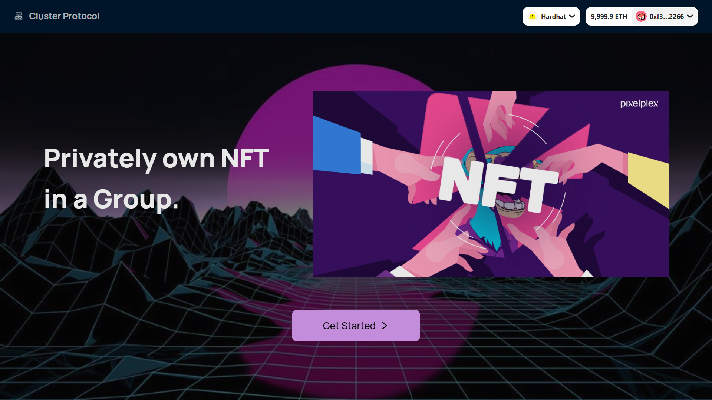
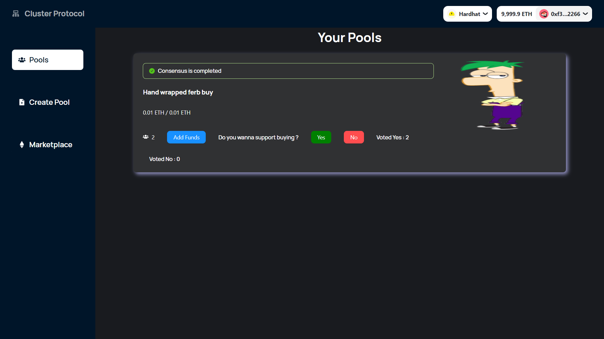
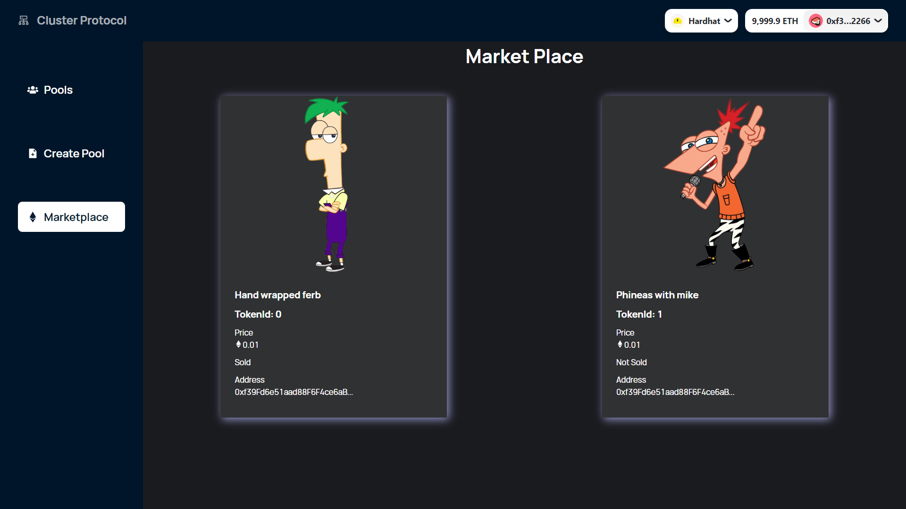
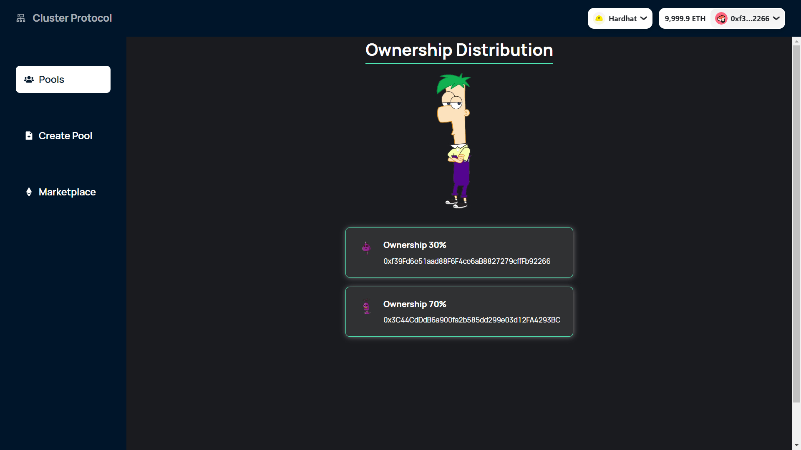
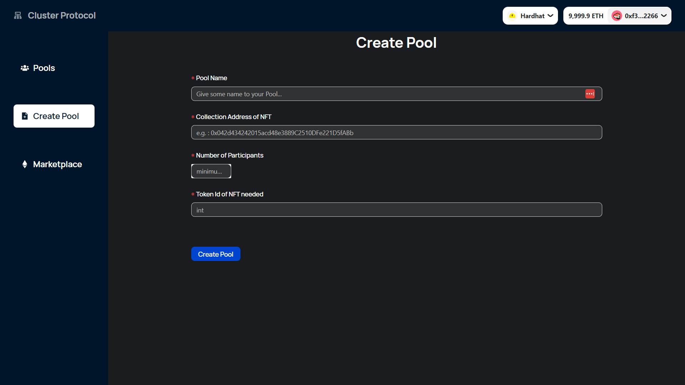

## Brief Overview

---

This project aims to fill the empty holes in various NFT Fractionalization platforms. For instance, fractional NFT space projects are aiming to make NFT more generalized and cost friendly to acquire. Due to this, a single NFT can be owned by many people which goes against the motto of NFT being a sole collectable asset. This solution would be filling this hole by allowing users to create a private group and that particular group can collectively deposit fund and can collectively buy the NFT and the ownership of the NFT will be divided based upon the contribution to the pool. Also, the necessary rights that come with the NFT will be given to the person who has contributed the most to the pool.

## Objectives

---

Core features we are planning to include in this project.

- Users can create pools of funds where each individual who is invited will be having an access to that pool to contribute funds into it. And each pool will have a target NFT aligned with it and buying that target NFT will be the aim of that pool.
- There will be a consensus mechanism which will involve approval of every pool member for performing buying or selling operations with the pool funds.
- Users will be able to manage pools, all the pools which he/she is part of will be displayed and the NFT corresponding to each pool will be rendered.
- Based upon the contribution into the pool the NFT rights will be given to agreed person/person with most contribution.
- There will be a seperate feed for people having the same level pool value.
- This platform will be kinda solving a problem being a habit tracker as well.

## Problem it solves

---

- Usually good NFTs are quite expensive and not affordable by an individual also the current fractional NFT projects focuses on making NFT more liquid and less focused on privatization and ownership of NFTs. Suppose there’s an NFT out there in the market but one individual can’t afford it solely and neither they want to acquire an NFT which is general (like most of the people have a fraction of it from the fractional NFT marketplace).
- In the above mentioned case, what user can do is that they can come to our platform, create a fund pool, invite people to the pool (with whom they are willing to share ownership of the NFT) and once everyone contributes to the pool(till the threshold prize associated with each pool reached) and majority agrees to buy(according to consensus) an NFT, then they can buy it and the ownership of that particular NFT will remain specifically to that group.
- Basically this project bridges the gap between solely buying an NFT and Fractionalizing an NFT making it more liquid and general.
- This platform will allow a group of individuals to mark an exclusive right over expensive NFTs.
- The current platforms which allow forming groups (like gnosis) and depositing funds is not community friendly. They are more like safe of funds and also the NFT rights handling issue is yet to be solved by them.

## Further thoughts

---

- Can further implement the meta transaction if user agrees to hold some specified amount of token for a specified duration.
- Modify/Add a habit tracking functionality where dapp will remind user to deposit funds on agreed basis and  to collect funds to buy the aimed NFTs.
- User can flex their NFTs through the feed they are having access to.
- Based upon the contribution into the pool the NFT rights will be given to agreed person / person with most contribution.
- This platform will be kinda solving a problem being a habit tracker as well. 
- Currently only buying of NFT and owning a fraction is supported will further be adding the selling part of it as well.

## How does it works

---

- Currently our Cluster protocol supports buying NFT of only one collection (the market place for the collection is embedded into platform currently) as the project is till the POC stage itself.
- User creates a pool for Buying NFT the pool contain information of NFT tokenId, collection address, participants of pools (people who want fractional ownership over NFT and are ready to contribute) and participants can contribute to the pool the contribution they will make will remain with smart contract.
- Once the contribution reach the NFT price a consensus will start which will ask each participant to vote whether to buy NFT or not and once the no of "yes" increase more than half of pool participants. Smart contract will buy that NFT in behalf of user from the market place and mint some unique ERC20 tokens corresponding to the unique id of pool and distribute tokens among participants (owners) based on their contribution to the pool and those unique ERC20 tokens will prove the ownership for the user over NFT. So basically smart contract acting as a wallet here for hold NFT belonging to a particular group of members.

## Network Directory

---
### Network: Goerli
### Market place contract: 0x099BFEFc39636E843779B82c3C2E9cE12e63d293
### Pool Manager Contract: 0x83e5b725376a3e3823A3931C979De399d45D2B98
### Fake NFT collection contract: 0x0bFE8CC582d06c9F05A8C96A68c52F02aB0E19D0

## Sneap peak

---

## Thankss